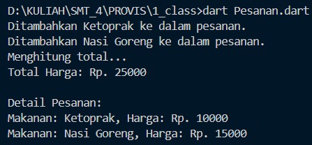

# Tugas Praktikum 1 Pemrograman Visual

## Data Diri

- 2202074
- Ahmad Taufiq Hidayat
- Ilmu Komputer C1'22
- Universitas Pendidikan Indonesia

## Program Pemesanan Makanan

Program Dart ini mensimulasikan sistem pemesanan makanan dengan menggunakan konsep Object-Oriented Programming (OOP) dan asynchronous.

## Detail Implementasi

### Kelas

#### `Makanan`

- Mewakili suatu item makanan dengan properti seperti nama dan harga.
- Menyediakan sebuah metode (`tampilkanInfo()`) untuk menampilkan informasi tentang makanan.

#### `Pesanan`

- Mengelola daftar item makanan dalam suatu pesanan.
- Menyediakan metode (`tambahItem()` dan `hitungTotal()`) untuk menambahkan item ke dalam pesanan dan menghitung total harga secara asynchronous.

### Operasi Asynchronous

Program ini menggunakan kelas `Future` dan kata kunci `async/await` untuk mensimulasikan operasi asynchronous. Metode `hitungTotal()` melakukan penundaan pada setiap iterasi untuk meniru operasi yang membutuhkan waktu.

## Screenshot

